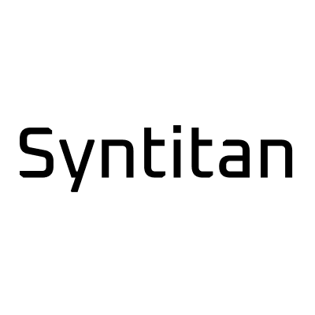

<p align="center">
  
</p>

# Syntitan MCP Server

The official [Model Context Protocol (MCP)](https://modelcontextprotocol.io) server for **Syntitan** by CUBIG — the AI-Ready Data Platform that fills the missing layer between enterprise data management and AI execution. It lets Claude and other MCP-compatible clients (Cursor, VS Code, Claude Code, ChatGPT, etc.) securely connect to Syntitan through natural language.

- **Category:** Data & Analytics
- **Transport:** Streamable HTTP
- **Authentication:** OAuth 2.0
- **Endpoint:** `https://mcp.syntitan.ai/mcp`

## Connecting

Add Syntitan as a remote MCP server in your client using the endpoint URL below:

```
https://mcp.syntitan.ai/mcp
```

On first connection your browser opens the Syntitan sign-in page. Log in and authorize access; the client then connects automatically. No API keys are stored in the client.

Cursor, VS Code, Claude Code, and other MCP clients support remote MCP servers — add the endpoint URL above following each client's connector instructions.

## Tools

| Tool (title) | Description | readOnlyHint | destructiveHint |
|---|---|---|---|
| Estimate Refinement Credits | Preview the estimated credits and time required before running a refinement | true | — |
| Get AI Readiness Detail | Break down a specific AI Readiness category to show which columns contributed and by how much | true | — |
| Get AI Readiness Summary | Return a dataset's overall AI Readiness score with per-category scores (Privacy, Conciseness, …) and the top-priority issues | true | — |
| Get Column Profile | Return detailed statistics for a single column, such as distinct/top values, missing rate, and example values | true | — |
| Get Dataset History | Return a dataset's full version history, including each version's release status, author, timestamp, and changes (masked PII entities and applied refinement modules) | true | — |
| Get Refinement Options | Return the available preprocessing options for a dataset, such as preprocessing modules and de-identification targets | true | — |
| Get Refinement Status | Return the progress and status of a running or completed refinement | true | — |
| Get Dataset Sample Rows | Return a sample of rows from a dataset with PII columns auto-masked; refuses if unmasked PII is present | true | — |
| Get Dataset Schema | Return a dataset's column structure — type, missing values, PII flags — without exposing PII column values | true | — |
| Get Diagnosis Guide | Return guidance on how to interpret AI Readiness diagnostic metrics and scores | true | — |
| List Datasets | List datasets the user can access, with each one's latest version, row/column counts, AI Readiness score, and last-modified time | true | — |
| Start Refinement | Run preprocessing/de-identification on a dataset (consumes credits); results are saved as a new snapshot | false | false |

## Example use cases

1. **"What datasets do I have right now?"** — Lists your datasets with their latest version, row/column counts, AI Readiness score, and last-modified time.
2. **"Give me a full diagnosis of this dataset."** — Returns the overall AI Readiness score with a per-category breakdown (Privacy, Conciseness, Contextuality, …) and the highest-priority issues to fix first.
3. **"Which columns have the missing values, and why?"** — Drills into a specific category to show exactly which columns contributed and by how much.
4. **"Show me 10 sample rows where region is null."** — Returns sampled rows; PII columns are returned only in masked form, and the request is refused if the dataset still has unmasked PII.
5. **"Mask all the PII columns in this dataset."** — Runs Syntitan's de-identification preprocessing in place and reports the before/after AI Readiness change.

## Authentication & security

Authentication uses **OAuth 2.0**. Users sign in through the Syntitan website; credentials are never shared with the MCP client. All traffic is served over HTTPS/TLS.

## Data handling

Syntitan accesses only the data required to fulfill a user's request. Audit logs (which may include user identifiers such as email) are retained for operational and security purposes in accordance with our privacy policy. Data collection, storage, retention, and deletion practices are described in the privacy policy linked below.

## Privacy & terms

- **Privacy Policy:** https://syntitan.ai/privacy-policy
- **Terms of Service:** https://syntitan.ai/terms-of-service

## Support

- **Email:** team-product@cubig.ai
- **Company:** CUBIG Corp.

## License
All rights reserved.

---

## 한국어 안내

**Syntitan MCP 서버**는 CUBIG의 Syntitan을 위한 공식 [MCP(Model Context Protocol)](https://modelcontextprotocol.io) 서버입니다. Syntitan은 엔터프라이즈 데이터 관리와 AI 실행 사이의 빠진 계층을 채우는 AI-Ready 데이터 플랫폼입니다. Claude를 비롯한 MCP 호환 클라이언트(Cursor, VS Code, Claude Code, ChatGPT 등)에서 자연어로 Syntitan에 안전하게 연결할 수 있습니다.

- **카테고리:** Data & Analytics
- **전송 방식:** Streamable HTTP
- **인증:** OAuth 2.0
- **엔드포인트:** `https://mcp.syntitan.ai/mcp`

### 연결 방법

클라이언트에 원격 MCP 서버로 아래 엔드포인트를 추가하세요:

```
https://mcp.syntitan.ai/mcp
```

처음 연결 시 브라우저에서 Syntitan 로그인 페이지가 열립니다. 로그인 후 접근을 승인하면 클라이언트가 자동으로 연결됩니다.

Cursor, VS Code, Claude Code 등 MCP 호환 클라이언트는 원격 MCP 서버를 지원합니다.

### 사용 예시

1. **"내가 지금 어떤 데이터셋들 갖고 있지?"** — 보유한 데이터셋을 최신 버전, 행/컬럼 수, AI Readiness 점수, 최근 변경 시각과 함께 조회합니다.
2. **"이 데이터셋 지금 상태 종합해서 알려줘."** — AI Readiness 종합 점수와 평가 항목별(Privacy, Conciseness, Contextuality 등) 점수, 가장 먼저 해결할 이슈를 함께 반환합니다.
3. **"결측치가 어느 컬럼에 있고 왜 그런 거야?"** — 특정 항목을 파고들어 어떤 컬럼이 얼마나 기여했는지 보여줍니다.
4. **"region이 null인 행 10개 샘플 보여줘."** — 샘플 행을 반환하며, PII 컬럼은 마스킹된 형태로만 제공되고 미마스킹 PII가 남아 있으면 응답을 거부합니다.
5. **"이 데이터셋 PII 컬럼 다 마스킹해줘."** — Syntitan 내부의 비식별화 전처리를 실행하고 전후 AI Readiness 변화를 보고합니다.

### 인증 및 보안

OAuth 2.0으로 인증하며, 사용자는 Syntitan 웹사이트에서 로그인합니다. 로그인 정보는 클라이언트와 공유되지 않고, 모든 통신은 HTTPS/TLS로 암호화됩니다.

### 데이터 처리

Syntitan은 사용자 요청을 처리하는 데 필요한 데이터에만 접근합니다. 감사로그(사용자 이메일 등 식별자 포함 가능)는 운영·보안 목적으로 개인정보 처리방침에 따라 보관됩니다. 데이터 수집·저장·보관·삭제에 관한 자세한 내용은 아래 처리방침을 참고하세요.

### 개인정보 처리방침 및 이용약관

- **개인정보 처리방침:** https://syntitan.ai/privacy-policy
- **이용약관:** https://syntitan.ai/terms-of-service

### 지원

- **이메일:** team-product@cubig.ai
- **회사:** CUBIG Corp.
